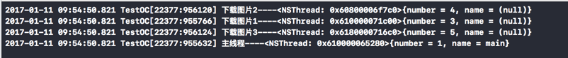
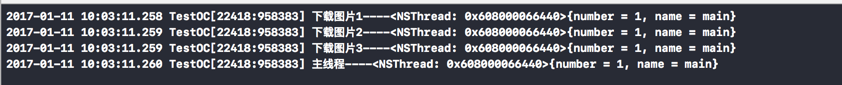

# 串行并行同步异步

##### 1. GCD

- GCD全称是Grand Central Dispatch
- GCD是苹果公司为多核的并行运算提出的解决方案
- GCD会自动利用更多的CPU内核（比如双核、四核）
- GCD会自动管理线程的生命周期（创建线程、调度任务、销毁线程）

##### 2. 任务和队列

- 任务：执行的操作
- 队列：用来存放任务

将任务添加到队列中，GCD会自动将队列中的任务取出，放到对应的线程中执行，任务的取出遵循队列的FIFO原则：先进先出，后进后出。

##### 3. 同步、异步、串行、并行

同步和异步决定了要不要开启新的线程

- 同步：在当前线程中执行任务，不开辟新线程
- 异步：在新的线程中执行任务，具备开启新线程的能力


并发和串行决定了任务的执行方式

- 并发：多个任务并发（同时）执行
- 串行：一个任务执行完毕后，再执行下一个任务

##### 4. 串行队列

GCD中获得串行有2种途径

- 使用dispatch_queue_create函数创建串行队列

  ```objective-c
  dispatch_queue_t queue = dispatch_queue_create("queneName", NULL);
  ```

- 使用主队列（跟主线程相关联的队列）

  主队列是GCD自带的一种特殊的串行队列,放在主队列中的任务，都会放到主线程中执行，使用dispatch_get_main_queue()获得主队列

  ```objective-c
  dispatch_queue_t queue = dispatch_get_main_queue();
  ```

  

##### 5. 并发队列

- GCD默认已经提供了全局的并发队列，供整个应用使用，使用dispatch_get_global_queue函数获得全局的并发队列 

```objective-c
dispatch_queue_t queue = dispatch_get_global_queue(DISPATCH_QUEUE_PRIORITY_DEFAULT, 0); // 获得全局并发队列

说明：全局并发队列的优先级
 
#define DISPATCH_QUEUE_PRIORITY_HIGH 2 // 高
 
#define DISPATCH_QUEUE_PRIORITY_DEFAULT 0 // 默认（中）
 
#define DISPATCH_QUEUE_PRIORITY_LOW (-2) // 低
 
#define DISPATCH_QUEUE_PRIORITY_BACKGROUND INT16_MIN // 后台
```

- 手动创建并发队列

  也可以手动创建并发队列

##### 6. 示例

- 用异步函数往并发队列中添加任务

```objective-c
//异步并发
-(void)ybbf{
    //获取全局并发队列
    dispatch_queue_t queue =  dispatch_get_global_queue(DISPATCH_QUEUE_PRIORITY_DEFAULT, 0);
    //2.添加任务到队列中，就可以执行任务
    dispatch_async(queue, ^{
       NSLog(@"下载图片1----%@",[NSThread currentThread]);
       });
    dispatch_async(queue, ^{
       NSLog(@"下载图片2----%@",[NSThread currentThread]);
           });
    dispatch_async(queue, ^{
       NSLog(@"下载图片3----%@",[NSThread currentThread]);
        });
    //打印主线程
    NSLog(@"主线程----%@",[NSThread mainThread]);
     
}
```



总结：异步并发执行3个任务，会开启3个子线程


- 用异步函数往串行队列中添加任务

```objective-c
//异步串行
-(void)ybcx{
    //创建一个队列，queneName不要加@，这里用c写法
    dispatch_queue_t queue =  dispatch_queue_create("queneName", NULL);
    //2.添加任务到队列中，就可以执行任务
    dispatch_async(queue, ^{
        NSLog(@"下载图片1----%@",[NSThread currentThread]);
    });
    dispatch_async(queue, ^{
        NSLog(@"下载图片2----%@",[NSThread currentThread]);
    });
    dispatch_async(queue, ^{
        NSLog(@"下载图片3----%@",[NSThread currentThread]);
    });
    //打印主线程
    NSLog(@"主线程----%@",[NSThread mainThread]);
     
}
```


总结：异步串行执行3个任务，只会开启一个子线程


- 用同步函数往并发队列中添加任务

```objective-c
//同步并发
-(void)tbbf{
    //获取全局并发队列
    dispatch_queue_t queue =  dispatch_get_global_queue(DISPATCH_QUEUE_PRIORITY_DEFAULT, 0);
    //2.添加任务到队列中，就可以执行任务
    dispatch_sync(queue, ^{
        NSLog(@"下载图片1----%@",[NSThread currentThread]);
    });
    dispatch_sync(queue, ^{
        NSLog(@"下载图片2----%@",[NSThread currentThread]);
    });
    dispatch_sync(queue, ^{
        NSLog(@"下载图片3----%@",[NSThread currentThread]);
    });
    //打印主线程
    NSLog(@"主线程----%@",[NSThread mainThread]);
     
}
```


总结：不会开启新的线程，并发队列失去了并发的功能


- 用同步函数往串行队列中添加任务

```objective-c
//同步串行
-(void)tbcx{
    //创建一个队列，queneName不要加@，这里用c写法
    dispatch_queue_t queue =  dispatch_queue_create("queneName", NULL);
    //2.添加任务到队列中，就可以执行任务
    dispatch_sync(queue, ^{
        NSLog(@"下载图片1----%@",[NSThread currentThread]);
    });
    dispatch_sync(queue, ^{
        NSLog(@"下载图片2----%@",[NSThread currentThread]);
    });
    dispatch_sync(queue, ^{
        NSLog(@"下载图片3----%@",[NSThread currentThread]);
    });
    //打印主线程
    NSLog(@"主线程----%@",[NSThread mainThread]);
     
}
```



总结：不会开启新的线程，创建的自定义队列无效


##### 6. 小结

同步函数不具备开启线程的能力，无论是什么队列都不会开启线程；异步函数具备开启线程的能力，开启几条线程由队列决定（串行队列只会开启一条新的线程，并发队列会开启多条线程）。


同步函数

- 并发队列：不会开线程
- 串行队列：不会开线程


异步函数

- 并发队列：能开启N条线程
- 串行队列：开启1条线程


##### 7. 避免死锁

停止等待事情的线程会导致多个线程相互维持等待，即死锁。

多个线程卡住，并互相等待对方完成或执行其它操作；第一个不能完成是因为它在等待第二个的完成；但第二个也不能完成，因为它在等待第一个的完成。

```objective-c
dispatch_sync(dispatch_get_main_queue(), ^{
       NSLog(@"111111");
   });
     
NSLog(@"222222");
```

执行上面的代码，你会发现没有任何打印，这个时候就是发生了死锁，我们禁止在主队列（iOS开发中，主队列是串行队列）中，再同步使用主队列执行任务，同理，**禁止在同一个同步串行队列中，再使用该串行队列同步的执行任务**，因为这样会造成死锁。

```objective-c
dispatch_queue_t queue = dispatch_queue_create("queneName", DISPATCH_QUEUE_SERIAL);
     
   dispatch_sync(queue, ^{
         
       NSLog(@"111111");
         
       dispatch_sync(queue, ^{
           NSLog(@"22222");
       });
         
       NSLog(@"3333333");
         
   });
   NSLog(@"44444444");
```

会发现，只是打印了一次，然后就造成了死锁。