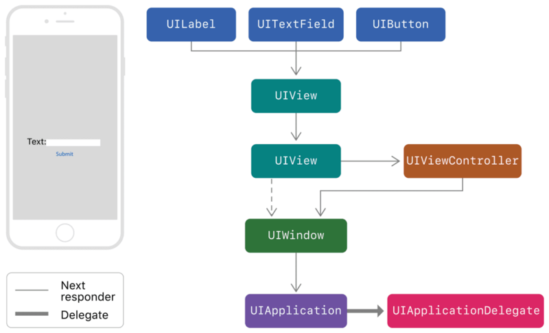
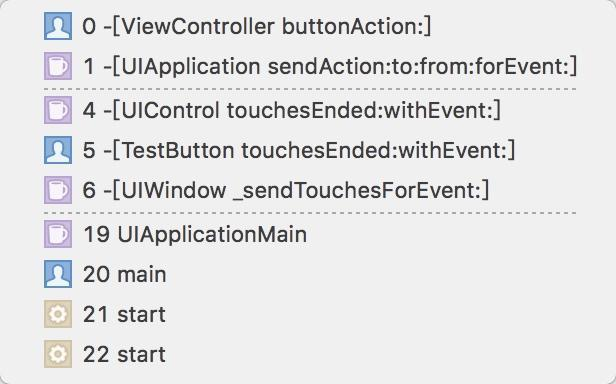
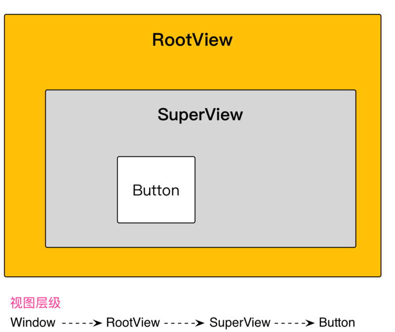

# 事件传递&视图响应

### 查找第一响应者

#### API

查找第一响应者时，有两个非常关键的`API`，查找第一响应者就是通过不断调用子视图的这两个`API`完成的。

```objective-c
- (UIView *)hitTest:(CGPoint)point withEvent:(UIEvent *)event;
```

`hitTest:withEvent:`方法内部会通过调用这个方法，来判断点击区域是否在视图上，是则返回`YES`，不是则返回`NO`。

```objective-c
- (BOOL)pointInside:(CGPoint)point withEvent:(UIEvent *)event;
```

内部可能的实现：

```objective-c
- (UIView *)hitTest:(CGPoint)point withEvent:(UIEvent *)event {
    if (self.alpha <= 0.01 || self.userInteractionEnabled == NO || self.hidden) {
        return nil;
    }
    
    BOOL inside = [self pointInside:point withEvent:event];
    if (inside) {
        NSArray *subViews = self.subviews;
        // 对子视图从上向下找
        for (NSInteger i = subViews.count - 1; i >= 0; i--) {
            UIView *subView = subViews[i];
            CGPoint insidePoint = [self convertPoint:point toView:subView];
            UIView *hitView = [subView hitTest:insidePoint withEvent:event];
            if (hitView) {
                return hitView;
            }
        }
        return self;
    }
    return nil;
}
```


#### 在`UIApplication`接收到响应事件之前

1. 系统通过`IOKit.framework`来处理硬件操作，其中屏幕处理也通过`IOKit`完成(`IOKit`可能是注册监听了屏幕输出的端口)。当用户操作屏幕，`IOKit`收到屏幕操作，会将这次操作封装为`IOHIDEvent`对象。通过`mach port`(IPC进程间通信)将事件转发给`SpringBoard`来处理。
2. `SpringBoard`是iOS系统的桌面程序。`SpringBoard`收到`mach port`发过来的事件，唤醒`main runloop`来处理。`main runloop`将事件交给`source1`处理，`source1`会用`__IOHIDEventSystemClientQueueCallback()`函数。
3. 函数内部会判断，是否有程序在前台显示，如果有则通过`mach port`将`IOHIDEvent`事件转发给这个程序。如果前台没有程序在显示，则表明`SpringBoard`的桌面程序在前台显示，也就是用户在桌面进行了操作。`__IOHIDEventSystemClientQueueCallback()`函数会将事件交给`source0`处理，`source0`会调用`__UIApplicationHandleEventQueue()`函数，函数内部会做具体的处理操作。
4. 例如用户点击了某个应用程序的icon，会将这个程序启动。应用程序接收到`SpringBoard`传来的消息，会唤醒`main runloop`并将这个消息交给`source1`处理，`source1`调用用`__IOHIDEventSystemClientQueueCallback()`函数，在函数内部会将事件交给`source0`处理，并调用`source0`的`__UIApplicationHandleEventQueue()`函数。在`__UIApplicationHandleEventQueue()`函数中，会将传递过来的`IOHIDEvent`转换为`UIEvent`对象。
5. 在函数内部，调用`UIApplication`的`sendEvent:`方法，将`UIEvent`传递给第一响应者或`UIControl`对象处理，在`UIEvent`内部包含若干个`UITouch`对象。

- `source1`是`runloop`用来处理`mach port`传来的系统事件的，`source0`是用来处理用户事件的。`source1`收到系统事件后，都会调用`source0`的函数，所以最终这些事件都是由`source0`处理的。

#### 应用程序收到事件之后

- 从`keyWindow`开始，向前逐级遍历子视图，不断调用`UIView`的`hitTest:withEvent:`方法，通过该方法查找在点击区域中的视图后，并继续调用返回视图的子视图的`hitTest:withEvent:`方法，以此类推。如果子视图不在点击区域或没有子视图，则当前视图就是第一响应者。
- 在`hitTest:withEvent:`方法中，会从上到下遍历子视图，并调用`subViews`的`pointInside:withEvent:`方法，来找到点击区域内且最上面的子视图。如果找到子视图则调用其`hitTest:withEvent:`方法，并继续执行这个流程，以此类推。如果子视图不在点击区域内，则忽略这个视图及其子视图，继续遍历其他视图。
- 可以通过重写对应的方法，控制这个遍历过程。通过重写`pointInside:withEvent:`方法，来做自己的判断并返回`YES`或`NO`，返回点击区域是否在视图上。通过重写`hitTest:withEvent:`方法，返回被点击的视图。
- 此方法在遍历视图时，忽略以下三种情况的视图，如果视图具有以下特征则忽略。但是视图的背景颜色是`clearColor`，并不在忽略范围内。
  - 视图的`hidden`等于YES
  - 视图的`alpha`小于等于0.01
  - 视图的`userInteractionEnabled`为NO
- 如果点击事件是发生在视图外，但在其子视图内部，子视图也不能接收事件并成为第一响应者。这是因为在其父视图进行`hitTest:withEvent:`的过程中，就会将其忽略掉。

#### 查找第一响应者并响应事件的流程总结

1. `UIApplication`接收到事件，将事件传递给`keyWindow`。
2. `keyWindow`遍历`subViews`的`hitTest:withEvent:`方法，找到点击区域内合适的视图来处理事件
3. `UIView`的子视图也会遍历其`subViews`的`hitTest:withEvent:`方法，以此类推。
4. 直到找到点击区域内，且处于最上方的视图，将视图逐步返回给`UIApplication`。
5. 在查找第一响应者的过程中，已经形成了一个响应者链。
6. 应用程序会先调用第一响应者处理事件。
7. 如果第一响应者不能处理事件，则调用其`nextResponder`方法，一直找响应者链中能处理该事件的对象。
8. 最后到`UIApplication`后仍然没有能处理该事件的对象，则该事件被废弃。

#### **示例**



1. 如果点击`UITextField`后其会成为第一响应者。
2. 如果`textField`未处理事件，则会将事件传递给下一级响应者链，也就是其父视图。
3. 父视图未处理事件则继续向下传递，也就是`UIViewController`的`View`。
4. 如果控制器的`View`未处理事件，则会交给控制器处理。
5. 控制器未处理则会交给`UIWindow`。
6. 然后会交给`UIApplication`。
7. 最后交给`UIApplicationDelegate`，如果其未处理则丢弃事件。

事件通过`UITouch`进行传递，在事件到来时，第一响应者会分配对应的`UITouch`，`UITouch`会一直跟随着第一响应者，并且根据当前事件的变化`UITouch`也会变化，当事件结束后则`UITouch`被释放。


`UIViewController`没有`hitTest:withEvent:`方法，所以控制器不参与查找响应视图的过程。但是控制器在响应者链中，如果控制器的`View`不处理事件，会交给控制器来处理。控制器不处理的话，再交给`View`的下一级响应者处理。

#### 事件拦截

有时候想让指定视图来响应事件，不再向其子视图继续传递事件，可以通过重写`hitTest:withEvent:`方法。在执行到方法后，直接将该视图返回，而不再继续遍历子视图，这样响应者链的终端就是当前视图。

```objective-c
- (UIView *)hitTest:(CGPoint)point withEvent:(UIEvent *)event {
    return self;
}
```

#### 事件转发

在开发过程中，经常会遇到子视图显示范围超出父视图的情况，这时候可以重写该视图的`pointInside:withEvent:`方法，将点击区域扩大到能够覆盖所有子视图。

假设有上面的视图结构，`SuperView`的`Subview`超出了其视图范围，如果点击`Subview`在父视图外面的部分，则不能响应事件。所以通过重写`pointInside:withEvent:`方法，将响应区域扩大为虚线区域，包含`SuperView`的所有子视图，即可让子视图响应事件。

#### 事件逐级传递

如果想让响应者链中，每一级`UIResponder`都可以响应事件，可以在每级`UIResponder`中都实现`touches`并调用`super`方法，即可实现响应者链事件逐级传递。

只不过这并不包含`UIControl`子类以及`UIGestureRecognizer`的子类，这两类会直接打断响应者链。

------

### Gesture Recognizer

手势识别器的优先级高于响应者链

**如果有事件到来时，视图有附加的手势识别器，则手势识别器优先处理事件。如果手势识别器没有处理事件，则将事件交给视图处理，视图如果未处理则顺着响应者链继续向后传递。**

当响应者链和手势同时出现时，也就是既实现了`touches`方法又添加了手势，会发现`touches`方法有时会失效，这是因为手势的执行优先级是高于响应者链的。

事件到来后先会执行`hitTest`和`pointInside`操作，通过这两个方法找到第一响应者，这个在上面已经详细讲过了。当找到第一响应者并将其返回给`UIApplication`后，`UIApplication`会向第一响应者派发事件，并且遍历整个响应者链。如果响应者链中能够处理当前事件的手势，则将事件交给手势处理，并调用`touches`的`calcelled`方法将响应者链取消。

在`UIApplication`向第一响应者派发事件，并且遍历响应者链查找手势时，会开始执行响应者链中的`touches`系列方法。会先执行`touchesBegan`和`touchesMoved`方法，如果响应者链能够继续响应事件，则执行`touchesEnded`方法表示事件完成，如果将事件交给手势处理则调用`touchesCancelled`方法将响应者链打断。

根据苹果的官方文档，手势不参与响应者链传递事件，但是也通过`hitTest`的方式查找响应的视图，手势和响应者链一样都需要通过`hitTest`方法来确定响应者链的。在`UIApplication`向响应者链派发消息时，只要响应者链中存在能够处理事件的手势，则手势响应事件，如果手势不在响应者链中则不能处理事件。

------

### UIControl

根据上面的手势和响应者链的处理规则，我们会发现`UIButton`、`UISlider`等继承自UIControl的控件，并不符合这个处理规则。`UIButton`可以在其父视图已经添加`tapGestureRecognizer`的情况下，依然正常响应事件，并且`tap`手势不响应。



以`UIButton`为例，`UIButton`也是通过`hitTest`的方式查找第一响应者的。区别在于，如果`UIButton`是第一响应者，则直接由`UIApplication`派发事件，不通过`Responder Chain`派发。如果其不能处理事件，则交给手势处理或响应者链传递。

不只`UIButton`是直接由`UIApplication`派发事件的，所有继承自`UIControl`的类，都是由`UIApplication`直接派发事件的。

------

### 事件传递优先级测试

##### 1. 示例1



假设`RootView`、`SuperView`、`Button`都实现`touches`方法，并且`Button`添加`buttonAction:`的`action`，点击`button`后的调用如下

```objc
RootView -> hitTest:withEvent:
RootView -> pointInside:withEvent:
Button -> hitTest:withEvent:
Button -> pointInside:withEvent:
RootView -> hitTest:withEvent:
RootView -> pointInside:withEvent:

Button -> touchesBegan:withEvent:
Button -> touchesEnded:withEvent:
Button -> buttonAction:
```

##### 2. 示例2

还是上面的视图结构，我们给`RootView`加上`UITapGestureRecognizer`手势，并且通过`tapAction:`方法接收回调，点击上面的`SuperView`后，方法调用如下。

```objc
RootView -> hitTest:withEvent:
RootView -> pointInside:withEvent:
Button -> hitTest:withEvent:
Button -> pointInside:withEvent:
SuperView -> hitTest:withEvent:
SuperView -> pointInside:withEvent:
RootView -> hitTest:withEvent:
RootView pointInside:withEvent:

RootView -> gestureRecognizer:shouldReceivePress:
RootView -> gestureRecognizer:shouldBeRequiredToFailByGestureRecognizer:
SuperView -> touchesBegan:withEvent:
RootView -> gestureRecognizerShouldBegin:
RootView -> tapAction:
SuperView -> touchesCancelled:
```

##### 3.示例3


上面的视图中`Subview1`、`Subview2`、`Subview3`是同级视图，都是`SuperView`的子视图。我们给`Subview1`加上`UITapGestureRecognizer`手势，并且通过`subView1Action:`方法接收回调，点击上面的`Subview3`后，方法调用如下。

```objc
SuperView -> hitTest:withEvent:
SuperView -> pointInside:withEvent:
Subview3 -> hitTest:withEvent:
Subview3 -> pointInside:withEvent:
SuperView -> hitTest:withEvent:
SuperView -> pointInside:withEvent:

Subview3 -> touchesBegan:withEvent:
Subview3 -> touchesEnded:withEvent:
```

通过上面的例子来看，虽然`Subview1`在`Subview3`的下面，并且添加了手势，点击区域是在`Subview1`和`Subview3`两个视图上的。但是由于经过`hitTest`和`pointInside`之后，响应者链中并没有`Subview1`，所以`Subview1`的手势并没有被响应。

#### 总结

**结合手势、UIButton、响应者链的优先级，总结整体响应逻辑**

- 当事件到来时，会通过`hitTest`和`pointInside`两个方法，从`Window`开始向上面的视图查找，找到第一响应者的视图。找到第一响应者后，系统会判断其是继承自`UIControl`还是`UIResponder`，如果是继承自`UIControl`，则直接通过`UIApplication`直接向其派发消息，并且不再向响应者链派发消息。
- 如果是继承自`UIResponder`的类，则调用第一响应者的`touchesBegin`，并且不会立即执行`touchesEnded`，而是调用之后顺着响应者链向后查找。如果在查找过程中，发现响应者链中有的视图添加了手势，则进入手势的代理方法中，如果代理方法返回可以响应这个事件，则将第一响应者的事件取消，并调用其`touchesCanceled`方法，然后由手势来响应事件。
- 如果手势不能处理事件，则交给第一响应者来处理。如果第一响应者也不能响应事件，则顺着响应者链继续向后查找，直到找到能够处理事件的`UIResponder`对象。如果找到`UIApplication`还没有对象响应事件的话，则将这次事件丢弃。