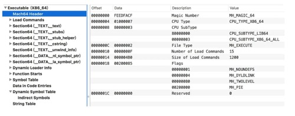

# Mach-O文件格式分析

Mach-O文件是OSX和iOS下的可执行文件，类似于linux下的ELF文件、windows下的PE32/PE32+文件，都是可执行文件的格式。在iOS上我们平时接触的库文件、DSYM文件、framework都属于这种格式的文件。


可以用[MachOView](https://sourceforge.net/projects/machoview/)查看Mach-O文件的结构

#### 1. Header结构

`Mach－O`的头部，使得可以快速确认一些信息，比如当前文件用于32位还是64位，对应的处理器是什么、文件类型是什么

用一段代码试验下：

```objective-c
#include <stdio.h>

int main(int argc, const char * argv[]) {
    printf("Hello, World!\n");
    return 0;
}
```

在终端中通过gcc命令生成可执行文件：a.out

```shell
gcc -g main.c
```

通过`MachOView`查看`.out`文件的格式



**header的数据结构部分**

32位

```c
struct mach_header {
    uint32_t    magic;      /* mach magic number identifier */
    cpu_type_t  cputype;    /* cpu specifier */
    cpu_subtype_t   cpusubtype; /* machine specifier */
    uint32_t    filetype;   /* type of file */
    uint32_t    ncmds;      /* number of load commands */
    uint32_t    sizeofcmds; /* the size of all the load commands */
    uint32_t    flags;      /* flags */
};
```

64位

```c
struct mach_header_64 {
    uint32_t    magic;      /* mach magic number identifier */
    cpu_type_t  cputype;    /* cpu specifier */
    cpu_subtype_t   cpusubtype; /* machine specifier */
    uint32_t    filetype;   /* type of file */
    uint32_t    ncmds;      /* number of load commands */
    uint32_t    sizeofcmds; /* the size of all the load commands */
    uint32_t    flags;      /* flags */
    uint32_t    reserved;   /* reserved */
};
```

64位的比32位的多了一个保留字段。

- `magic`魔数：用于确认是32位还是64位
- `cputype`cpu类型：比如arm，x86
- `cpusubtype`cpu具体类型：比如arm64、armv7
- `filetype`文件类型：比如可执行文件、库文件、Dsym文件，demo中是`MH_EXECUTE`，代表可执行文件

```c
 * Constants for the filetype field of the mach_header
 */
#define MH_OBJECT   0x1     /* relocatable object file */
#define MH_EXECUTE  0x2     /* demand paged executable file */
#define MH_FVMLIB   0x3     /* fixed VM shared library file */
#define MH_CORE     0x4     /* core file */
#define MH_PRELOAD  0x5     /* preloaded executable file */
#define MH_DYLIB    0x6     /* dynamically bound shared library */
#define MH_DYLINKER 0x7     /* dynamic link editor */
#define MH_BUNDLE   0x8     /* dynamically bound bundle file */
#define MH_DYLIB_STUB   0x9     /* shared library stub for static */
#define MH_DSYM     0xa     /* companion file with only debug */
#define MH_KEXT_BUNDLE  0xb     /* x86_64 kexts */
```

- `ncmds ：`加载命令条数
- `sizeofcmds`：所有加载命令的大小
- `reserved：`保留字段
- `flags：`标志位，刚才`demo`中显示的都在这里了

```c
#define MH_NOUNDEFS 0x1     // 目前没有未定义的符号，不存在链接依赖
#define    MH_DYLDLINK  0x4     // 该文件是dyld的输入文件，无法被再次静态链接
#define MH_PIE 0x200000     // 加载程序在随机的地址空间，只在 MH_EXECUTE中使用
#define    MH_TWOLEVEL  0x80    // 两级名称空间
```

**随机地址空间**

进程每一次启动，地址空间都会简单地随机化。

对于大多数应用程序来说，地址空间随机化是一个和他们完全不相关的实现细节，但是对于黑客来说，它具有重大的意义。

如果采用传统的方式，程序的每一次启动的虚拟内存镜像都是一致的，黑客很容易采取重写内存的方式来破解程序。采用`ASLR`可以有效的避免黑客攻击。

**dylb**

动态链接器，他是苹果开源的一个项目，可以在这里[下载](http://opensource.apple.com/tarballs/dyld/dyld-360.18.tar.gz)，当内核执行`LC_DYLINK`（后面会说到）时，连接器会启动，查找进程所依赖的动态库，并加载到内存中。

**二级名称空间**

这是`dyld`的一个独有特性，说是符号空间中还包括所在库的信息，这样子就可以让两个不同的库导出相同的符号，与其对应的是平坦名称空间。

#### 2. Load commands 结构

`Load commands`紧跟在头部之后，这些加载指令告诉我们加载器如何处理二进制数据，有些命令是由内核处理的，有些是由动态链接器处理的。在源码中有明显的注释来说明这些是动态连接器处理的。

```c
// 将文件的32位或64位的段映射到进程地址空间
#define LC_SEGMENT  0x1 
#define LC_SEGMENT_64   0x19    

// 唯一的 UUID，标示二进制文件
#define    LC_UUID      0x1b    /* the uuid */

// 刚才提到的，启动动态加载连接器
#define    LC_LOAD_DYLINKER 0xe /* load a dynamic linker */

// 代码签名和加密
#define    LC_CODE_SIGNATURE 0x1d   /* local of code signature */
#define LC_ENCRYPTION_INFO 0x21 /* encrypted segment information */
```

`load command`的结构如下

```c
struct load_command {
    uint32_t cmd;       /* type of load command */
    uint32_t cmdsize;   /* total size of command in bytes */
};
```

通过 `MachOView`来继续查看刚才Demo中的`Load commands`的一些细节，`LC_SEGMENT_64`和`LC_SEGMENT`是加载的主要命令，它负责指导内核来设置进程的内存空间


`cmd：`就是`Load commands`的类型，这里`LC_SEGMENT_64`代表将文件中64位的段映射到进程的地址空间。`LC_SEGMENT_64`和`LC_SEGMENT`的结构差别不大，下面只列举一个

```c
struct segment_command_64 { /* for 64-bit architectures */
    uint32_t    cmd;        /* LC_SEGMENT_64 */
    uint32_t    cmdsize;    /* includes sizeof section_64 structs */
    char        segname[16];    /* segment name */
    uint64_t    vmaddr;     /* memory address of this segment */
    uint64_t    vmsize;     /* memory size of this segment */
    uint64_t    fileoff;    /* file offset of this segment */
    uint64_t    filesize;   /* amount to map from the file */
    vm_prot_t   maxprot;    /* maximum VM protection */
    vm_prot_t   initprot;   /* initial VM protection */
    uint32_t    nsects;     /* number of sections in segment */
    uint32_t    flags;      /* flags */
};
```

- `cmdsize：`代表`load command`的大小

- `VM Address ：`段的虚拟内存地址

- `VM Size ：` 段的虚拟内存大小

- `file offset：`段在文件中偏移量

- `file size：`段在文件中的大小

将该段对应的文件内容加载到内存中：从`offset`处加载 `file size`大小到虚拟内存 `vmaddr`处，把16进制的offset加上当前的size就是下一个segment的offset起始地址。

由于这里在内存地址空间中是`_PAGEZERO`段（这个段不具有访问权限，用来处理空指针）所以都是零。

还有图片中的其他段，比如`_TEXT`对应的就是代码段，`_DATA`对应的是可读／可写的数据，`_LINKEDIT`是支持`dyld`的，里面包含一些符号表等数据

- `nsects`: 当前segment中有多少个section
- `segment name`: 段名字，当前是`__PAGEZERO`

#### 3. Segment & Section


